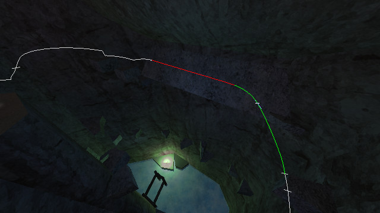

# HLStrafe
HLStrafe is a library for Half-Life player movement prediction and
optimization. It is used in [Bunnymod XT](https://github.com/YaLTeR/BunnymodXT)
as the backend for the TASing support and the TAS editor.

## Features
- Full ground and air player movement prediction.
- Optimal movement computation:
    - maximum acceleration,
    - fastest turning,
    - maximum deceleration,
    - speed-preserving (constant speed).
- Vectorial strafing: look into an arbitrary direction while strafing.
- Automatic jumping, duck-tapping, jump-bugging, ducking before collision.
- Duck-tapping without ground friction via 0 ms frames.
- Full support for arbitrary movement variables, such as negative
  `sv_airaccelerate`.
